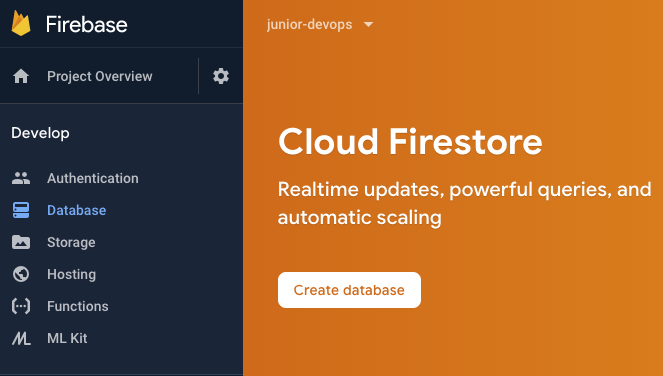

# Deploying Applications


## How do apps get deployed?

You have written your amazing app, how do you deploy it? This workshop covers a few common ways.


Click the **Start** button to move to the next step.


## What is Cloud Shell?

Before we start, let's familiarize ourselves with the environment.

Cloud Shell is a free, serverless console for Google Cloud that comes packaged with key tools like:
* The `gcloud` CLI (Command Line Interface), which executes commands in your Google Cloud project.
* `git`, a tool to track changes in code, and distribute it.

*** 

Let's familiarize ourselves with the Cloud Shell environment. Click "Next" below.
> **Note**: Some of these tips can be applied to most terminals you encounter, like MacOS Terminal or Windows Powershell!

## Navigating the console

Here's an example of a command you can execute. Either type in the command to your terminal, or click the <walkthrough-cloud-shell-icon></walkthrough-cloud-shell-icon> icon below

```bash
gcloud projects list
```

* `gcloud` is the program you are running.
* `projects` is a **parameter** to `gcloud`, and `list` is in turn a **parameter** to `projects`.

### Options and arguments

Try adding the `--help` option to the command from before:

```bash
gcloud projects list --help
```

You should see text explaining what this command does. `--help` is a common option you can use in many programs that explains commands and their parameters. Try executing

```bash
gcloud projects --help
```

This shows other parameters you can pass to `gcloud projects`.


### Set your active project
```bash
gcloud config set project PROJECT_ID
```

Click **Next** to continue setting up the application.

## Understanding the application

Before we deploy an application, we'll need to understand how it works. 
The application is based on a [Firestore lab by Google Cloud](https://codelabs.developers.google.com/codelabs/firestore-web/#0) - read it to understand how to run the application.

#### Creating a Firebase project

This application uses Firestore (which requires a Firebase project) to store its data.
Open the Firebase console at https://console.firebase.google.com/ and Create a project, selecting the project that you have created. ***(Don't create a new project!)***

Select the Blaze (Pay as you go) plan - don't worry, you should be staying well within the free tier in this lab.

#### Create your Firestore Database

Firestore is a managed NoSQL database on Google Cloud Platform.

